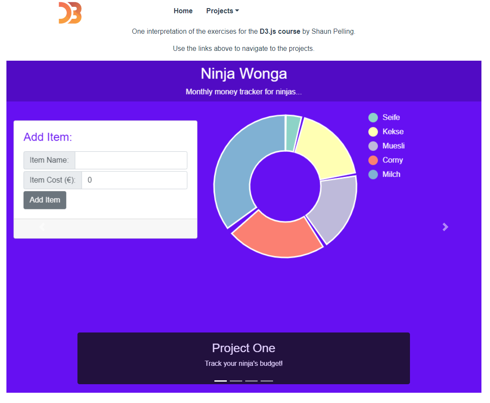

# data-viz-d3-and-firebase

This project combines the exercises of Shaun Pelling's D3.js & Firebase course with a Bootstrap-Vue SPA (as opposed to Vanilla JS and Material design.)



## Project setup

This project assumes you are running against a firebase firestore instance for persistence. See [Google's documentation](https://cloud.google.com/firestore/docs/quickstart-servers) for creating a firestore instance.

Once you've created a firestore instance, you will need to setup the environment file with your configuration values. If you'd like, you can simply run the command:

```
npm run setup
```

And a blank configuration file will be created for you. **You will still need to add your own configuration values.**

Otherwise, you can do this yourself by simply copying the below snippet into a file called `.env.local` and filling in with the values from the firebase console: Settings > Project Settings:

```
VUE_APP_FIREBASE_API_KEY='YOUR_VAL_HERE'
VUE_APP_FIREBASE_AUTH_DOMAIN='YOUR_VAL_HERE'
VUE_APP_FIREBASE_DB_URL='YOUR_VAL_HERE'
VUE_APP_FIREBASE_PROJ_ID='YOUR_VAL_HERE'
VUE_APP_FIREBASE_STORAGE_BUCKET='YOUR_VAL_HERE'
VUE_APP_FIREBASE_MESSAGE_SENDER_ID='YOUR_VAL_HERE'
VUE_APP_FIREBASE_MESSAGE_APP_ID='YOUR_VAL_HERE'
```

This file is automatically setup to be ignored by version control, and should allow you to store the necessary credentials only on the machine running the app, without accidentally publishing them by committing them.

## Running the project

After setup, the rest is the same as normal for a project managed with NPM. To start:

```
npm install
```

Then to run:

_Compiles and hot-reloads for development_

```
npm run serve
```

_Compiles and minifies for production_

```
npm run build
```

_Lints and fixes files_

```
npm run lint
```

_Run the unit tests_

```
npm run test:unit
```

## End-to-end (e2e) tests

### Using Firebase Emulator

The project uses Cypress for e2e testing. Note that the tests assume a certain database state that can be easily recreated by starting the [firebase firestore emulator](https://firebase.google.com/docs/emulator-suite) locally with the provided seed data.

Once you've made sure to setup firebase tools locally (you can check with `firebase --help`, and making sure you get a list of commands), then loading the seed data can be accomplished by running the following command at repo root (on **Windows only** for now - see "Limitations" below):

```
firebase emulators:start --import=./cypress/fixtures/firebase
```

Alternatively, by starting the emulator without the seed data, you will start with the database in a clean state.

#### Limitations

Due to internal issues in the firebase emulator, the export currently only works on Windows (where it was initially exported), and it will cause the emulator to crash if import is attempted on Linux/macOS (see firebase-tools issue 2421).

#### Starting the app

Finally, to have the application connect to the emulated instance of firebase you can start it with:

```
npm run serve:e2e
```

This makes use of [Vue CLI's modes](https://cli.vuejs.org/guide/mode-and-env.html) and environment variables to [wire up the emulator instead](./src/firestore/index.js#14).
